# qdless user guide

`qdless` is an interactive terminal viewer for gridded weather data and a few
related formats. It draws the data as a colour raster made of Unicode block
characters, so it runs over plain SSH in any modern terminal: no X11, no
browser, no GUI toolkit.

This guide covers every feature. The images were captured from a live
`qdless` session. Most animations are real time; a few are sped up where the
source file is slow to sample.

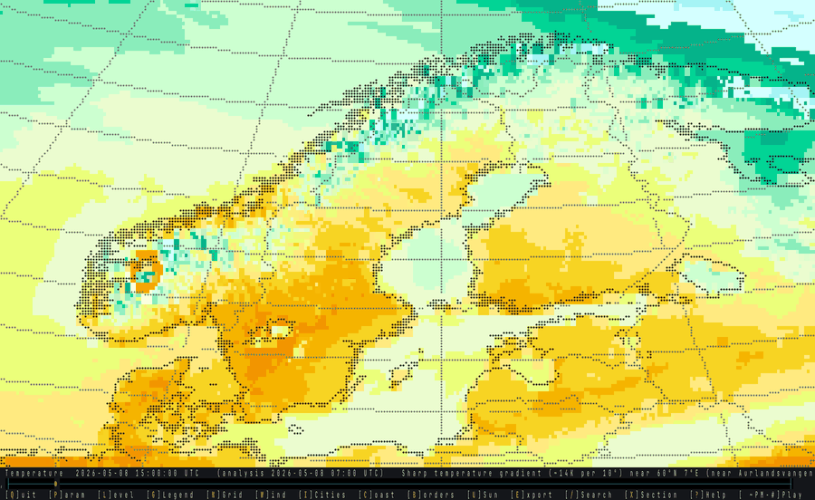

**Contents**

1. [Starting qdless](#1-starting-qdless)
2. [The screen](#2-the-screen)
3. [Moving around: zoom and pan](#3-moving-around-zoom-and-pan)
4. [Time and animation](#4-time-and-animation)
5. [Parameters and levels](#5-parameters-and-levels)
6. [Legend, metadata and help](#6-legend-metadata-and-help)
7. [Map overlays](#7-map-overlays)
8. [Cell styles and graphics modes](#8-cell-styles-and-graphics-modes)
9. [Place search](#9-place-search)
10. [Time-series probe](#10-time-series-probe)
11. [Cross-sections](#11-cross-sections)
12. [3D curtain: the animated cross-section](#12-3d-curtain-the-animated-cross-section)
13. [3D point cloud](#13-3d-point-cloud)
14. [Globe view](#14-globe-view)
15. [Sunlight and twilight shadow](#15-sunlight-and-twilight-shadow)
16. [Multi-panel layouts](#16-multi-panel-layouts)
17. [Phenomenon hints](#17-phenomenon-hints)
18. [PNG export](#18-png-export)
19. [Data sources](#19-data-sources)
20. [Exit effects](#20-exit-effects)
21. [Headless use: `--dump` and `--extrema`](#21-headless-use---dump-and---extrema)
22. [Configuration and files](#22-configuration-and-files)
23. [Key reference](#23-key-reference)
24. [Command-line reference](#24-command-line-reference)

---

## 1. Starting qdless

```bash
qdless forecast.sqd                     # QueryData
qdless model.grib2                      # GRIB1 / GRIB2
qdless sst.nc                           # NetCDF
qdless pvol.h5                          # ODIM HDF5 radar volume or composite
qdless radar.tif                        # GeoTIFF
qdless areas.shp                        # ESRI shapefile
qdless picture.png                      # plain image (PNG, WebP, JPEG, GIF, BMP)
qdless f1.tif f2.tif f3.tif             # several files = one animation
qdless --dir radar_frames/              # every file in a directory = one animation
qdless --catalog /masala/datasets       # browse a SmartMet/radon file store
qdless --pg "host=db dbname=gis"        # browse PostGIS tables
```

Useful options when starting up:

| Option | Effect |
| --- | --- |
| `-p Temperature` | Start with this parameter. A comma-separated list opens [several panels](#16-multi-panel-layouts). |
| `-t 8` | Start at time index 8 (0-based; `-1` = last). |
| `-l 3` | Start at level index 3 (0-based; `-1` = last). |
| `--palette seatemperature` | Force a palette instead of the automatic choice. |
| `--3d`, `--globe`, `--sun` | Start in the 3D point cloud, the globe, or with the twilight shadow on. |

The terminal needs UTF-8 and a font with the *Symbols for Legacy Computing*
block (sextant characters). Most current monospace fonts have it: JetBrains
Mono, Cascadia, Iosevka, Noto Sans Mono. If yours doesn't, press `t` to switch
to [quadrant blocks](#8-cell-styles-and-graphics-modes). Colours are 24-bit
when `COLORTERM` says so, otherwise the nearest xterm-256 colour. On macOS
Terminal.app, which lacks the sextant glyphs, qdless starts in quadrant mode
automatically.

## 2. The screen

- **Map area**: everything above the bottom three lines. It shows the active
  parameter in the file's own projection (polar stereographic, Lambert,
  rotated lat/lon, …), with coastlines, borders and a lat/lon graticule on top.
- **Status line**: parameter, valid time, level (for multi-level data), the
  model run time labelled `analysis`, the animation delay while playing, and
  then either the last message or a [phenomenon hint](#17-phenomenon-hints).
- **Timeline**: one tick per time step, with `●` marking the current one.
- **Key bar**: the most-used keys. Press `?` for the full list, which only
  shows the keys that work for the current data and view.

Sources without time (shapefiles, PostGIS layers) show no time or analysis
field, and single-level data shows no level.

## 3. Moving around: zoom and pan


| Key / gesture | Action |
| --- | --- |
| `+` / `-` | Zoom in / out around the centre |
| `h` `j` `k` `l` | Pan left / down / up / right (vim keys) |
| `Shift`+arrows | Pan |
| mouse drag | Pan |
| double-click left / right | Zoom in / out at the pointer |
| mouse wheel | Zoom (on terminals that report the wheel) |
| `0` | Reset to the whole grid |


Zooming works in the file's native projection, so a polar-stereographic grid
stays polar-stereographic however far you zoom in. Coastlines switch to a
higher-resolution GSHHG data set as you zoom in.

## 4. Time and animation

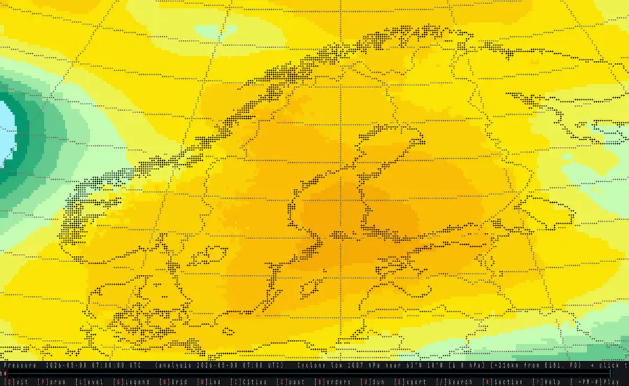

| Key | Action |
| --- | --- |
| `←` / `→` | Previous / next time step |
| `Home` / `End` | First / last time step |
| `Space` | Play / pause |
| `↑` / `↓` | Faster / slower (the status line shows the frame delay, e.g. `[250 ms]`) |

Every view animates: 2D maps, all panels of a multi-panel layout, the probe
popup, cross-sections, the 3D views and the globe.

## 5. Parameters and levels

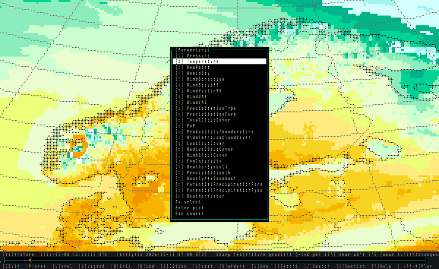

- `p` opens the parameter menu. Move with `↑`/`↓` or jump with the shown
  hotkey (`1`–`9`, `a`–`z`). The map previews each entry as you move, and
  `Enter` keeps it.
- `L` (Shift+L) opens the level menu, which previews in the same way. GRIB
  files that carry a parameter on several level types (pressure, hybrid,
  height, …) show one section per type. Hybrid levels are listed from the
  surface upwards so the hotkeys land on the levels you use most.
- `<` / `>` (or `,` / `.`) step one level down or up without opening the menu.

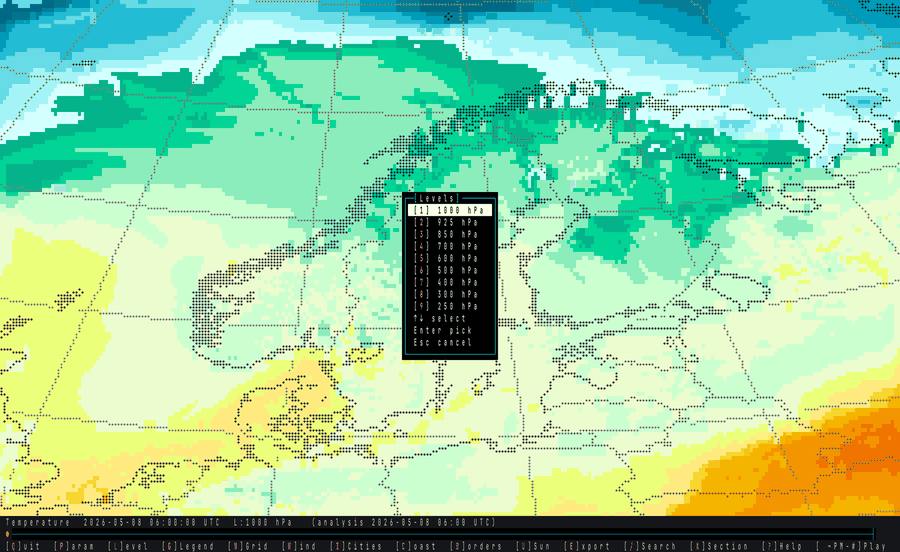

Units are converted where it helps the palette: Kelvin becomes °C, Pa becomes
hPa and fractions become %. The detection checks both the unit string and the
parameter name, so a sea-surface temperature gets the sea-temperature palette
and an ocean current doesn't get the wind palette. The time-series probe shows
the converted unit too.

## 6. Legend, metadata and help

| Key | Popup |
| --- | --- |
| `g` | Legend: palette colours with their value ranges (scrolls with `PgUp`/`PgDn`) |
| `M` (Shift+M) | File metadata: format, producer, grid, projection, extent, times, levels, parameters |
| `?` | Help. It lists only the keys that work for the current data and view, and scrolls on short terminals. |

| | |
| --- | --- |
| 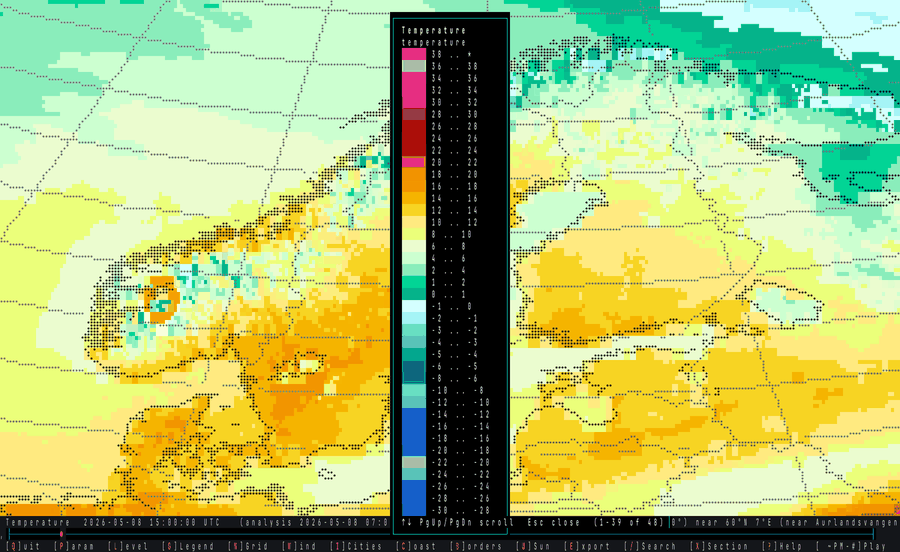 | 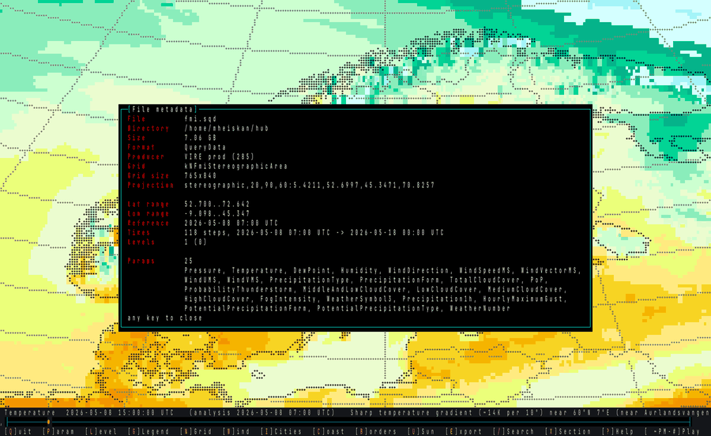 |

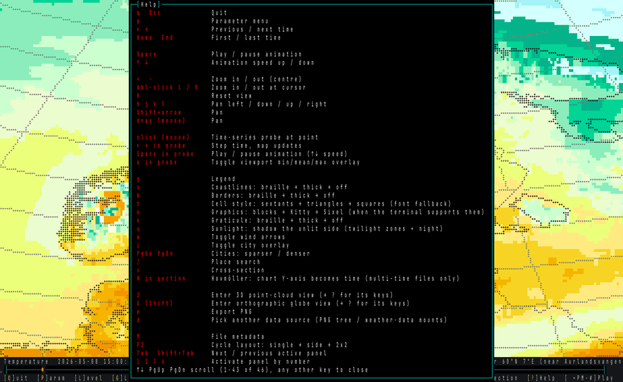

Values outside the palette's range are left uncoloured rather than clamped to
the nearest colour. That is why, for example, precipitation below 0.1 mm shows
no colour at all.

## 7. Map overlays

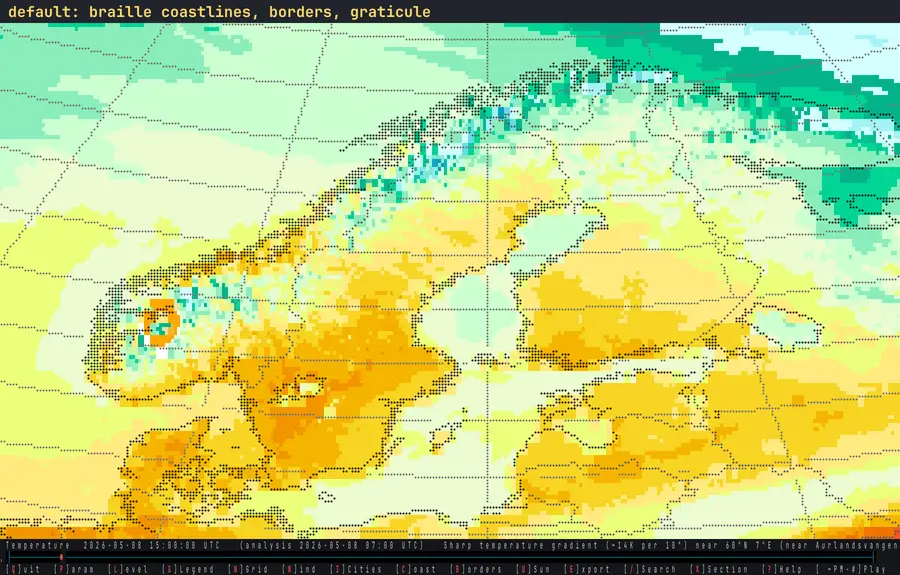

| Key | Overlay |
| --- | --- |
| `c` | Coastlines: thin braille → thick → off |
| `b` | Political borders: thin braille → thick → off |
| `n` | Lat/lon graticule: thin braille → thick → off |
| `i` | City names (the most populous places in view, from GeoNames `cities1000`) |
| `PgDn` / `PgUp` | More / fewer cities (5 … 500) |
| `w` | Wind arrows, when the file has U and V wind components |

The default *braille* style draws lines a quarter of a cell wide, so the data
shows through around them. *Thick* burns the lines into the raster at half-cell
width. Lakes are filtered by area and compactness (`--min-lake-area`,
`--min-lake-roundness`) and small islands by area (`--min-island-area`), which
keeps real lakes such as Vänern and drops the fractal noise of Saimaa.

| | |
| --- | --- |
| 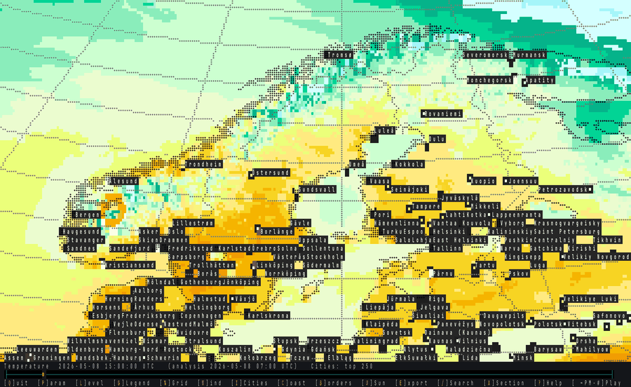 | 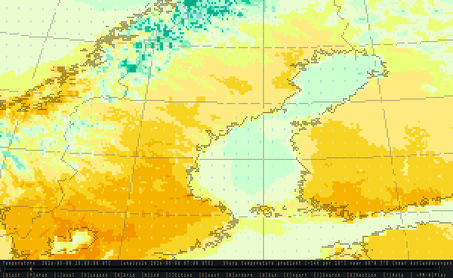 |

Wind arrows are coloured by speed and drawn over the underlying data colour.

## 8. Cell styles and graphics modes

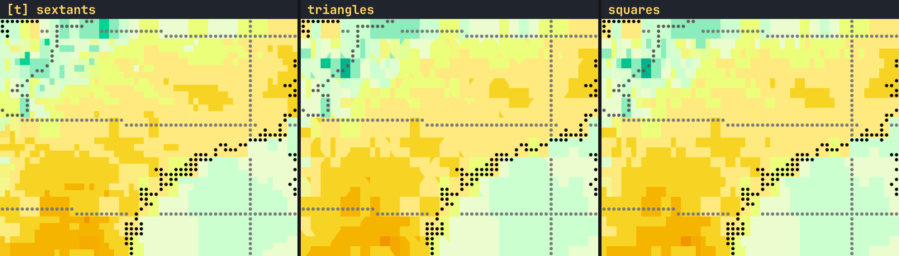

`t` cycles how each terminal cell is subdivided:

- **sextants** (default): 2×3 sub-pixels per cell, 64 glyphs from the
  *Symbols for Legacy Computing* block. This is the highest resolution.
- **triangles**: 2×2 quadrants, plus small corner triangles that smooth
  diagonal edges.
- **squares**: 2×2 quadrants only. These use Unicode 1.1 block elements, so
  they work in every font.

`s` switches to real pixel graphics when the terminal supports it:
blocks → **Kitty** graphics protocol → **Sixel** → blocks. qdless detects
support at startup. In pixel mode the raster uses one sample per screen pixel,
and every overlay, the probe and the twilight shadow keep working.

## 9. Place search


`/` opens an incremental search over about 170,000 GeoNames places. Type a few
letters, pick with `↑`/`↓` and `Enter`. qdless drops a marker on the place,
zooms to it, and opens the [time-series probe](#10-time-series-probe) there.

## 10. Time-series probe

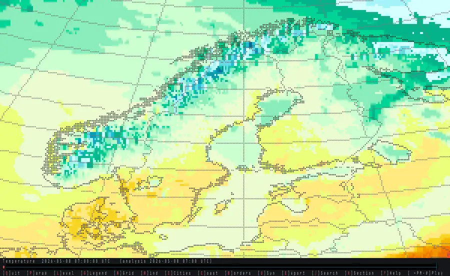

Click anywhere on the map to open a braille chart of the value at that point
over all time steps. A marker shows the probed point on the map.

| Key in the probe | Action |
| --- | --- |
| `←` / `→` | Step time. The map and the chart cursor follow. |
| `Space` | Play / pause (`↑`/`↓` change speed) |
| `s` | Overlay the viewport minimum / mean / maximum at each time step |
| click on the map | Move the probe to that point |
| any other key | Close |

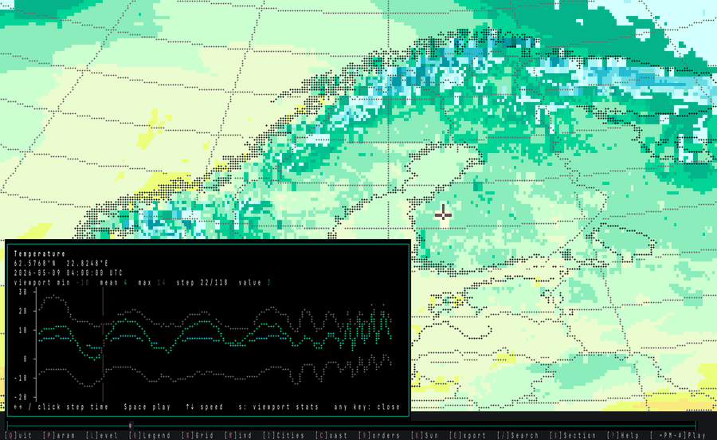

For data with a single time step but several levels, such as a radar volume,
the probe draws a **vertical profile** instead, and the arrow keys step through
the levels. The popup scales with the terminal, so the chart keeps a similar
physical size whatever the font size.

## 11. Cross-sections

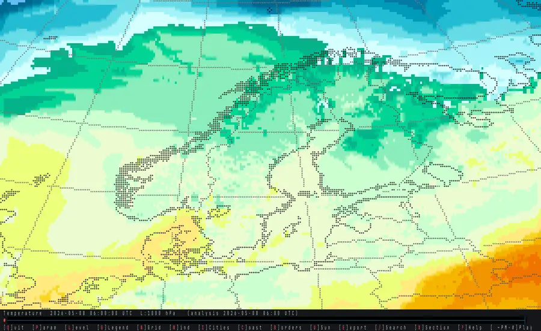

Press `x`, then click two points on the map. A chart of the parameter along
that line against height opens in a popup placed away from the line. Moving
the pointer along the chart moves a dot along the line on the map, so you can
see where each feature is.

| Key | Action |
| --- | --- |
| `x` | Start a cross-section (then click two endpoints); press again to close it |
| `y` | Y axis: height in km ↔ one row per level (pressure or model level, or elevation angle for radar) |
| `H` (Shift+H) | Hovmöller diagram: the Y axis becomes time (files with several time steps) |
| `←` / `→`, `Space` | Step / animate time. The chart updates. |

| | |
| --- | --- |
| 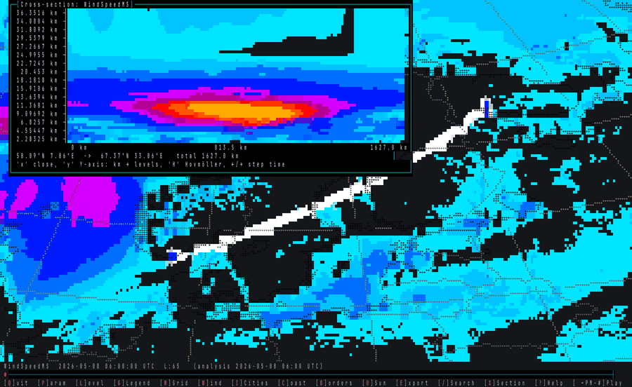 <br/>Hybrid (model) levels through the jet stream | 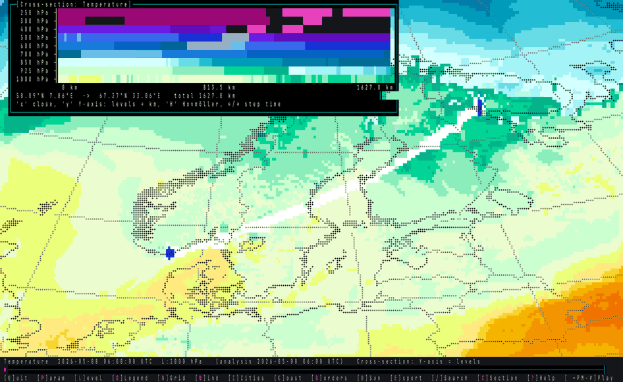 <br/>`y`: one row per pressure level |

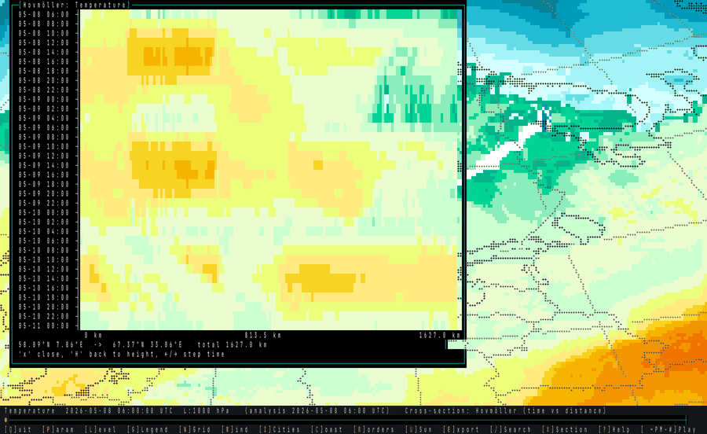

For a radar volume, height mode gives a true RHI-style section, and `y`
switches to one row per sweep elevation, with a `MAX` row for the column
maximum:

| | |
| --- | --- |
| 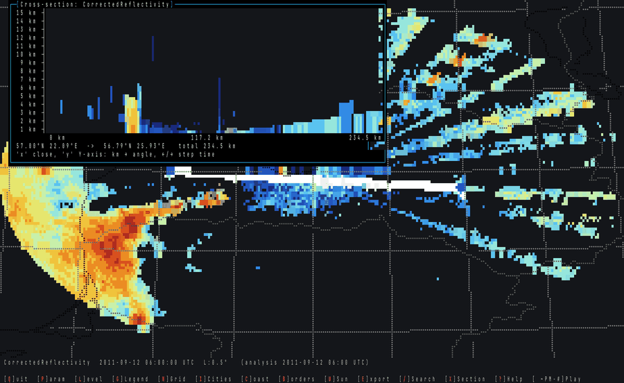 | 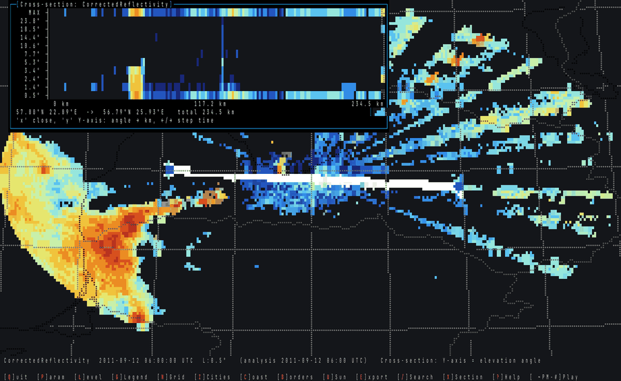 |

## 12. 3D curtain: the animated cross-section

`v` switches to a 3D view: the current level is drawn as a ground plane seen
at an angle, and a vertical *curtain* shows the cross-section standing on it.
The curtain can be moved, rotated and animated, which makes it a quick way to
explore a whole 3D field. It needs data with a real vertical axis: QueryData
on pressure or model levels with a height field, radar volumes, or catalog
cubes on pressure or height levels.


The curtain starts as a diagonal across the middle of the data, from the
ground up to the top of the data's height range. The status bar shows the
sub-mode, both endpoints, the ceiling, the camera zoom and the animation speed.

### Animations

Four independent animations can be switched on and off in any combination.
They keep their phase when switched off, so you can stop the curtain at an
interesting angle.

| Key | Animation |
| --- | --- |
| `s` | **Swing**: sweep the plane sideways across the data and back. The sweep stays over the actual data, including the empty corners of a Lambert domain. |
| `r` | **Rotate**: spin the plane about its centre |
| `o` | **Orbit**: move the plane's centre around a circle |
| `T` (Shift+T) | **Tilt**: rock the plane about its long axis |
| `x` | **X-cross**: add a second plane at right angles through the same centre |

| Swing (`s`) | Rotate (`r`) |
| --- | --- |
| 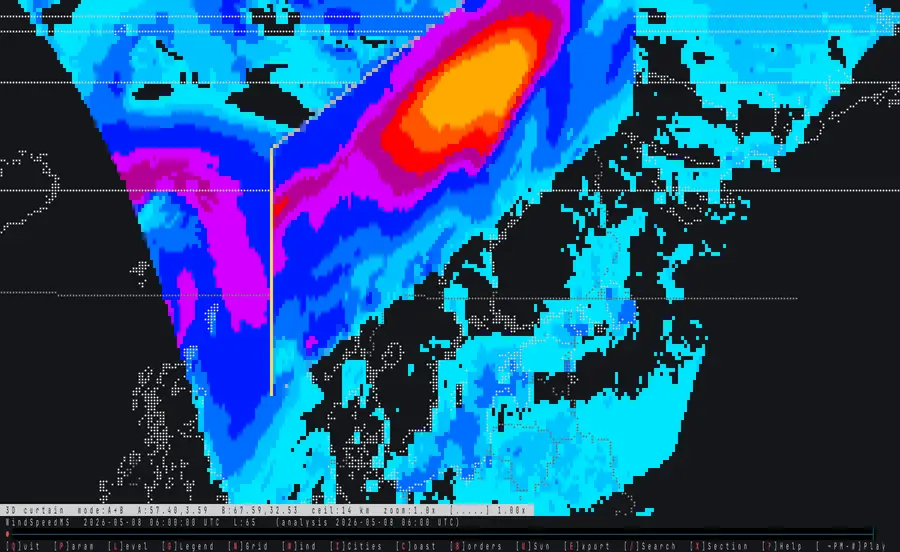 | 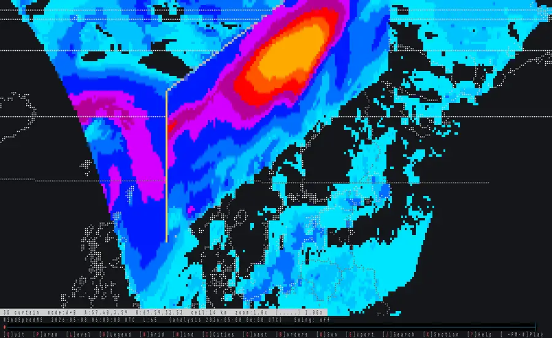 |
| **Orbit (`o`)** | **Tilt (`T`)** |
|  |  |

The X-cross rotating (`x` then `r`):


Orbit, rotate and swing together (`o` `r` `s`):


### Moving the endpoints and the camera

`Tab` cycles the sub-mode that the arrow keys act on:
**A → B → A+B → View** (`Shift+Tab` goes backwards).

- **A**, **B**: the arrow keys move that endpoint.
- **A+B**: the arrow keys move the whole curtain.
- **View**: the arrow keys orbit and pitch the camera, and `+`/`-` zoom.

`h` `j` `k` `l` always move the camera, whatever the sub-mode. In the three
edit sub-modes `+`/`-` set the animation speed (shown as e.g. `1.25x`).


### Ceiling and time

- `PgUp` / `PgDn` raise / lower the top of the curtain by 1 km.
- `Space` plays the forecast. The ground plane and the curtain are both
  re-sampled at every step.
- `0` resets the camera.

| Ceiling (`PgUp`/`PgDn`) | Time animation (`Space`) |
| --- | --- |
| 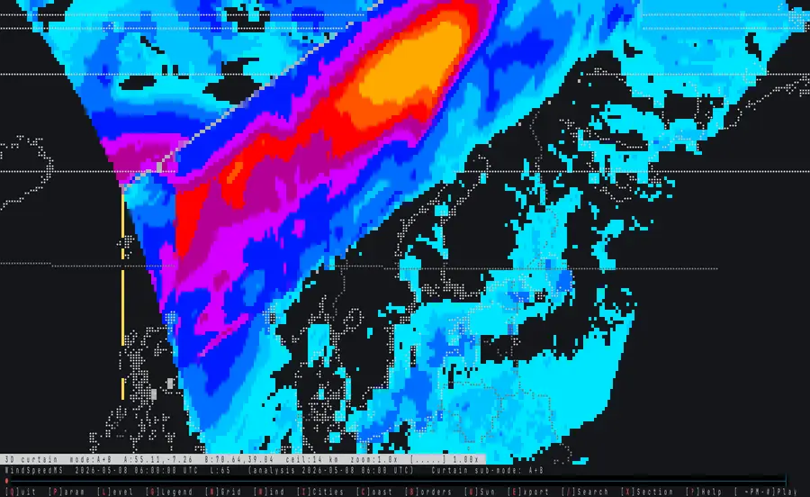 |  |

`v` returns to the 2D map. `?` shows the curtain's own key list:

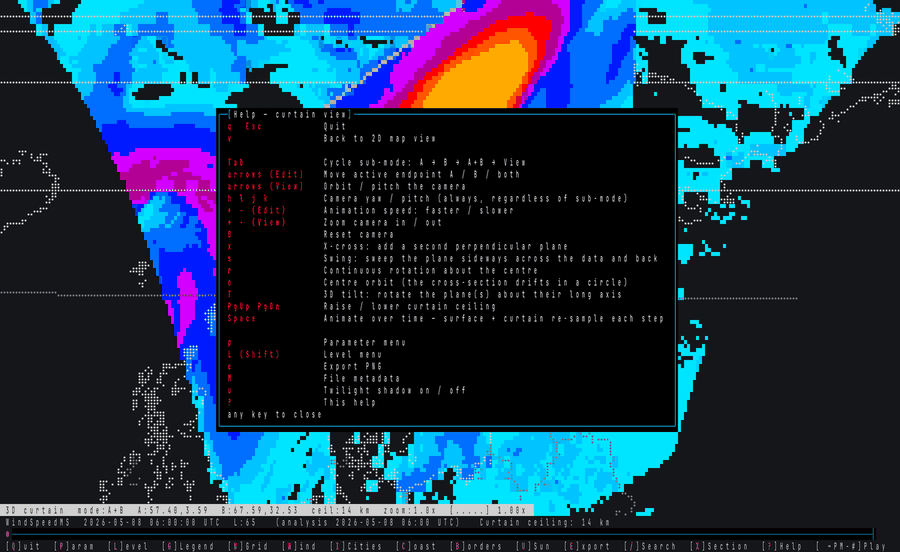

## 13. 3D point cloud

`3` switches to a 3D point cloud: every grid point (or radar bin) above a
threshold is drawn as a point in space, with depth sorting and the coastlines
on the ground.

### Radar volumes

An ODIM polar volume (`.h5`) is drawn sweep by sweep at the correct beam
heights. The threshold is in dBZ and starts at −10 dBZ.

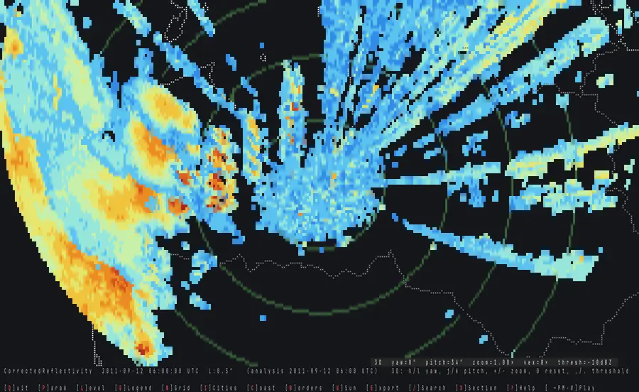

In 2D, the radar's sweeps are its levels, so `<`/`>` step through the
elevation angles:


### Model data

Multi-level QueryData is sampled on a coarse 3D lattice. Cloud cover, humidity
and probabilities are thresholded in percent (starting at 50 %). Any other
parameter is thresholded in its own units, starting from the field's minimum
so that everything is visible at first. Raising the threshold with `.` then
isolates the interesting part.

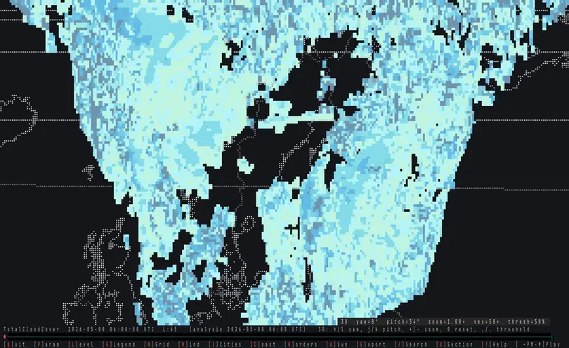

### The jet stream in 3D

Wind speed on model levels shows the jet stream as a solid body. The wind
palette's colour bands nest inside each other: 21–26 m/s red, 26–32 m/s
red-orange, above 32 m/s orange. Raising the threshold therefore peels the
jet from the outside in. Here it steps from 15 m/s, where the whole upper
troposphere is filled, up to 40 m/s, where only the fastest cores are left,
and back to 30 m/s:

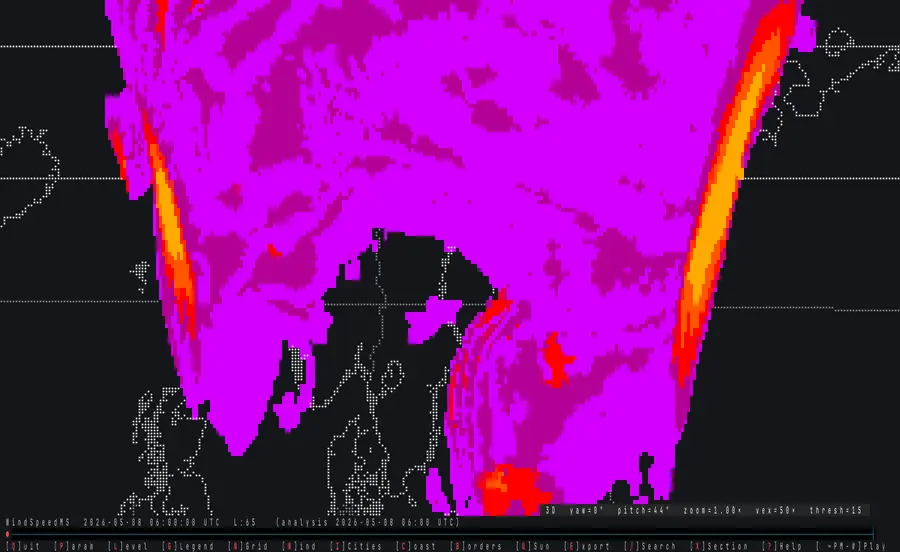

At 30 m/s the jet is a single body, with the cores above 32 m/s showing as
orange streaks inside it. Orbiting and pitching the camera (`h` `l` `j` `k`)
shows how it runs from the Norwegian Sea over northern Scandinavia and turns
south across Finland:

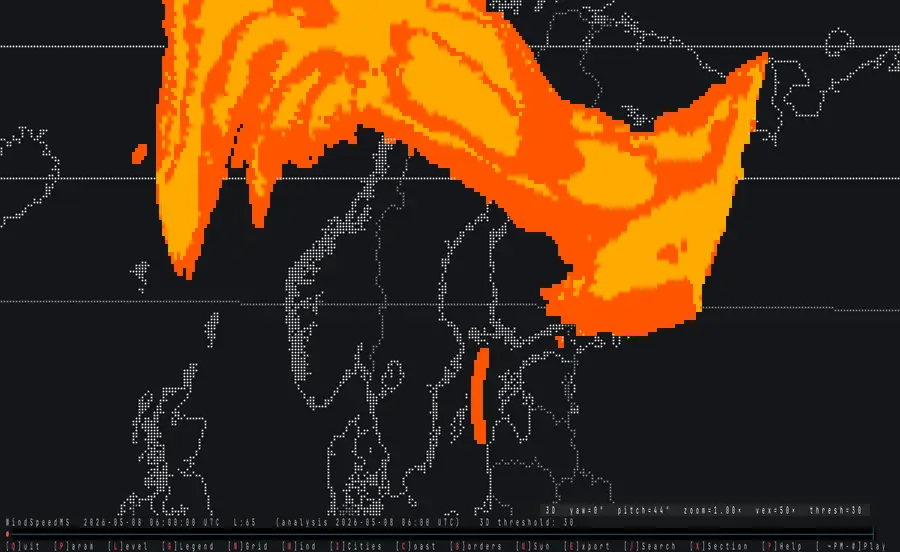

`Space` plays the forecast in 3D too. Every hourly step is re-sampled, so you
can watch the jet evolve. Over these 30 hours it swings east, splits into
two branches, and a new core forms in the south:

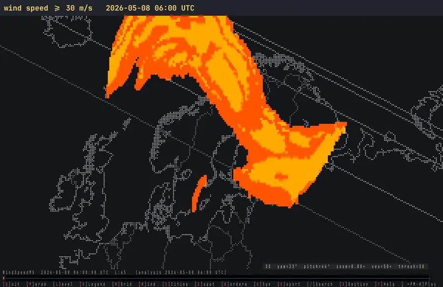

To reproduce: `qdless -p WindSpeedMS meps_hybrid.sqd`, press `3`, then `.`
six times, then `Space`.

| Key | Action |
| --- | --- |
| `h` / `l` | Yaw left / right |
| `j` / `k` | Pitch down / up |
| `+` / `-` | Zoom |
| `,` / `.` | Lower / raise the threshold by 5 units |
| `PgUp` / `PgDn` | More / less vertical exaggeration |
| `0` | Reset the camera |
| `x` | QueryData on hybrid or pressure levels: toggle **persistent anomaly air masses**, the extrema of the field after removing each level's median, found with a merge tree |
| `3` | Back to the 2D map |

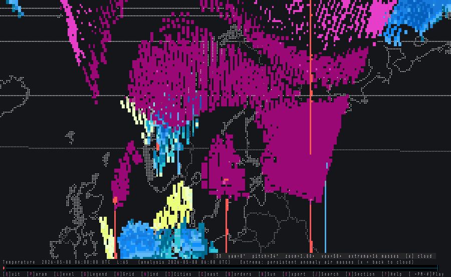

Single-level QueryData, for example a surface forecast with cloud layers,
shows a synthetic stack instead: low, middle and high cloud, precipitation and
fog as layers at typical heights.

## 14. Globe view

`G` (Shift+G) draws any gridded data on an orthographic globe.

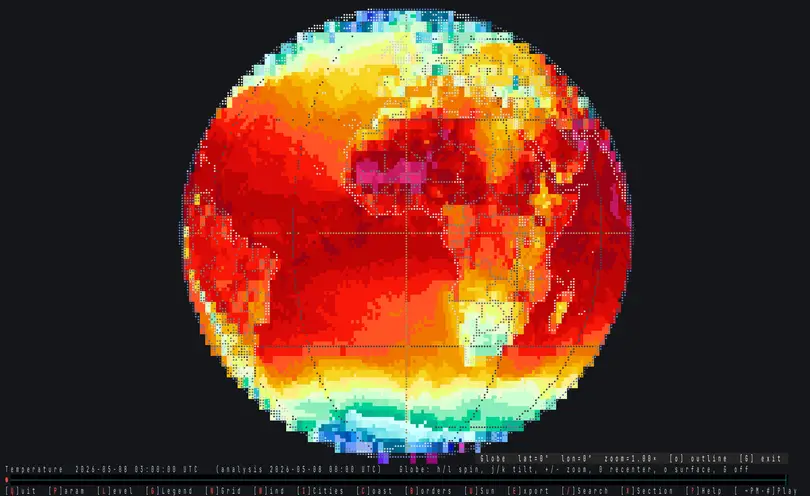

| Key | Action |
| --- | --- |
| `h` / `l` | Spin west / east |
| `j` / `k` | Tilt |
| `+` / `-` | Zoom |
| `0` | Centre on the data again |
| `o` | Surface fill where there is no data: outline → ocean → land → both |
| click | Probe or cross-section endpoint, as on the 2D map |
| `G` | Back to the 2D map |

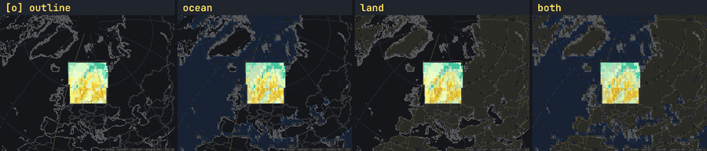

`--globe` starts in this view and `--globe-surface outline|ocean|land|both`
sets the initial fill.

## 15. Sunlight and twilight shadow

`u` (or `--sun`) shades the part of the Earth where the sun is down, with
civil (0…−6°), nautical (−6…−12°) and astronomical (−12…−18°) twilight and
night (below −18°) as separate zones. The sunlit side is left untouched. The
shading blends towards neutral grey, never a colour, so shaded cells still
match the legend. The status line shows the subsolar point.

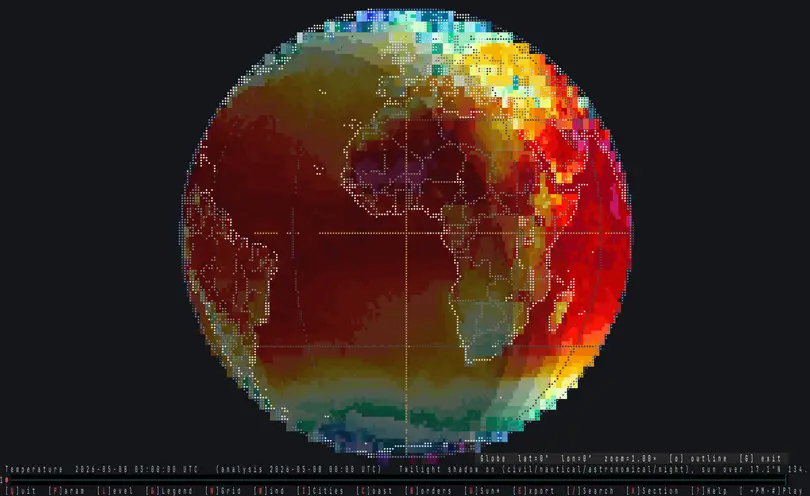

The shadow works on the 2D map, on the globe, in all 3D views (drawn on the
ground plane behind the 3D content), in the Kitty/Sixel modes and in PNG
export.

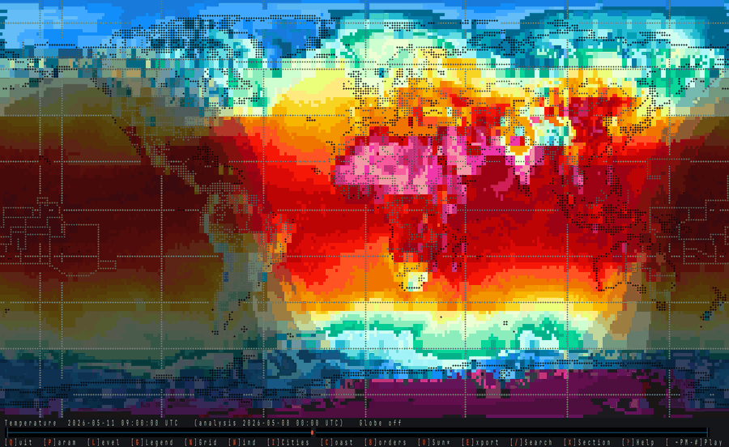

## 16. Multi-panel layouts


`-p` with a comma-separated list opens several panels. One parameter gives a
single panel, two give a side-by-side pair, and three or four give a 2×2 grid
(with three, the fourth panel repeats the first). More than four is an error.

```bash
qdless -p Temperature,DewPoint forecast.sqd
qdless -p Temperature,Pressure,WindSpeedMS,TotalCloudCover forecast.sqd
qdless --layout side forecast.sqd        # force a layout
```

All panels share the viewport, the time, the marker and the overlay settings.
Each panel has its own parameter, level and palette. The *active* panel,
highlighted in its label, is the one that `p`, `L`, `g`, the probe, the
cross-section and PNG export act on.

| Key | Action |
| --- | --- |
| `F2` | Cycle layout: single → side by side → 2×2 |
| `Tab` / `Shift+Tab` | Next / previous active panel |
| `1` … `4` | Activate a panel by number |
| click | Activate the panel under the pointer |

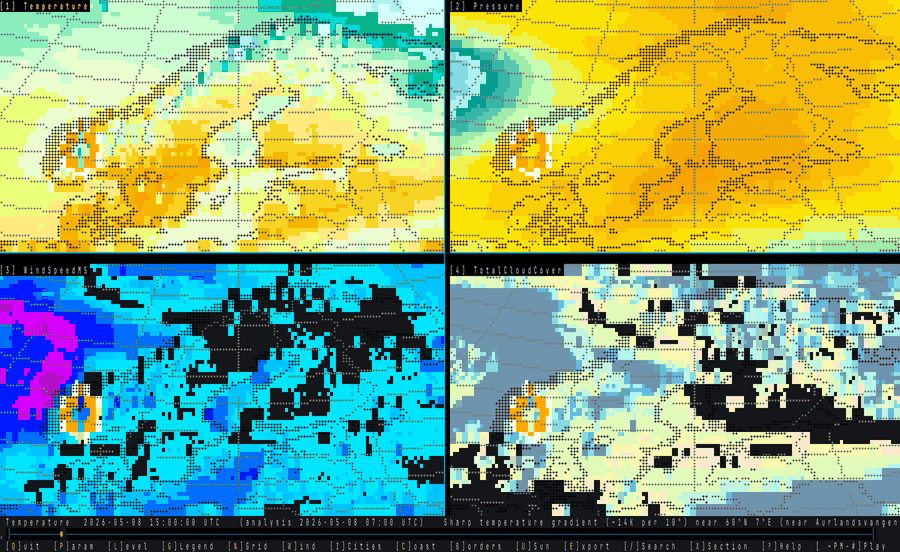

## 17. Phenomenon hints

A few cheap detectors run whenever the parameter, level or file changes. They
look for cyclones (pressure minima with a strong gradient), fronts
(temperature gradient peaks), jet streams (upper-level wind over 40 m/s),
atmospheric blocks, tropical convection and fields that don't change over
time. The best match appears on the status line with a suggestion, for example:

```
Cyclone low 1007 hPa near 63°N 10°W (Δ 8 hPa) (~216km from Eiði, FO)  → click the centre to …
```

Where the hint has a location, an orange ring marks it on the map. Hints only
ever appear on the status line and give way to any other message, so a false
positive is harmless.

## 18. PNG export

`e` writes the active panel to
`<file>_<parameter>_<YYYYMMDD>_<HHMM>.png` in the current directory. The status
line confirms the name. The image covers the visible area in the file's native
projection at about 720 px tall, on a white background, with the coastlines and
borders that are switched on and (when it is on) the twilight shadow drawn in.
Catalog cubes, `--dir` series and PostGIS tables are named after the cube
directory, the first file or the table.

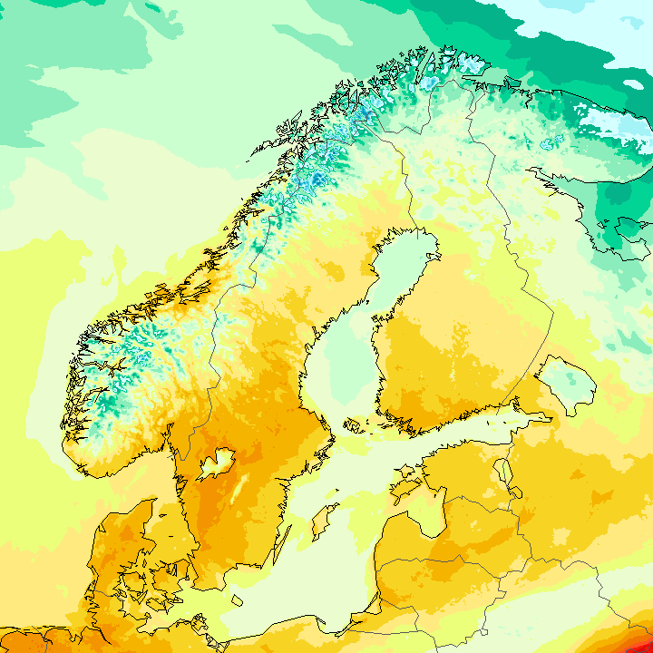

## 19. Data sources

### QueryData, GRIB, NetCDF

QueryData (`.sqd`) is read natively through `newbase`, in its own projection.
GRIB1/GRIB2 and NetCDF go through `smartmet-library-grid-files`, and grids
that grid-files cannot place on the map fall back to GDAL. The fallback covers
CF NetCDF on a bare lon/lat grid (WAM and NEMO wave and ocean output) and GRIB
on projections missing from the grid-files geometry table, such as transverse
Mercator.

| | |
| --- | --- |
| 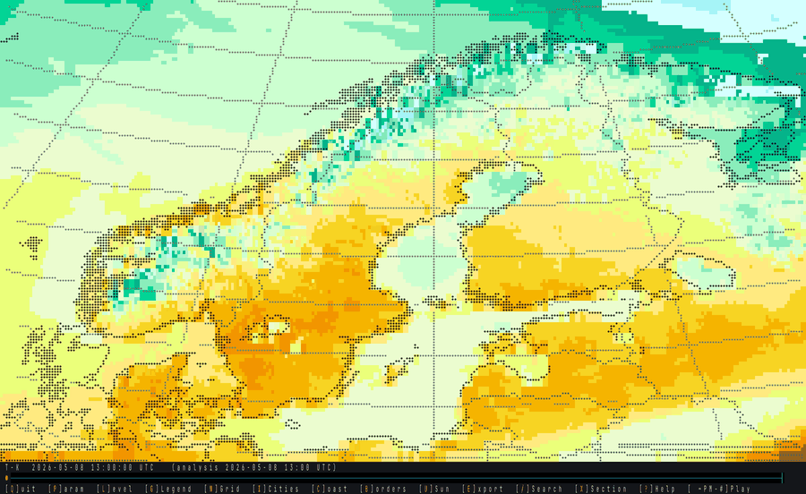 <br/>GRIB2, K → °C | 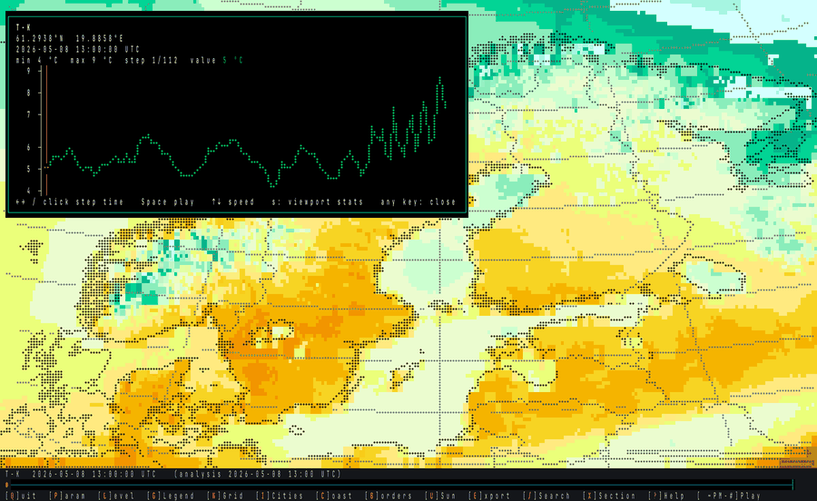 <br/>Probe values and units in °C |
| 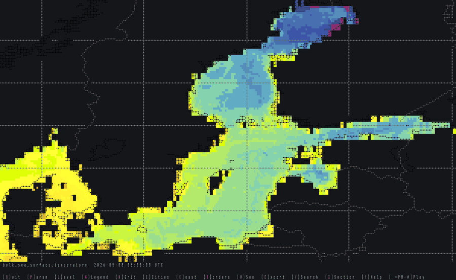 <br/>NetCDF sea-surface temperature | 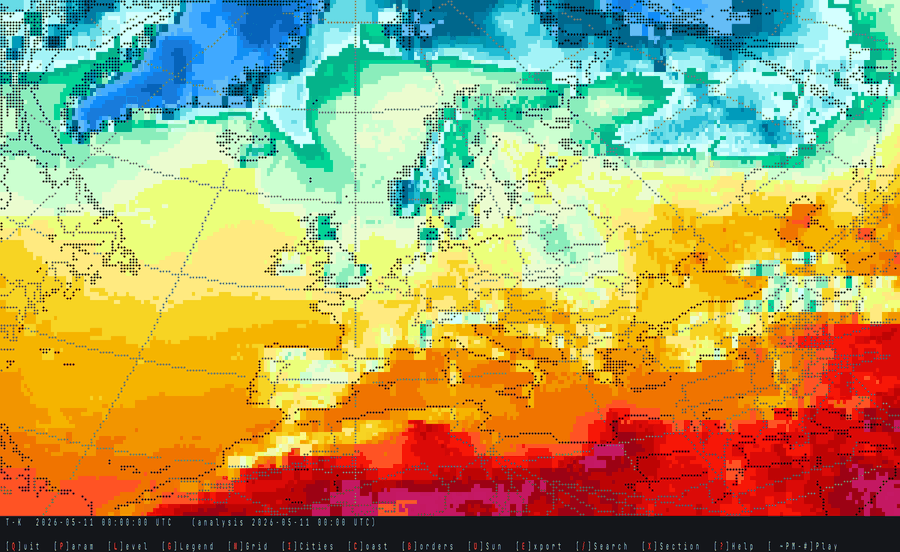 <br/>Global GRIB1 |
| 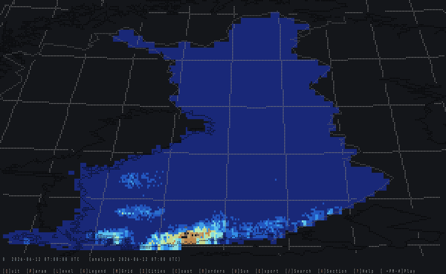 <br/>Transverse Mercator GRIB2 | 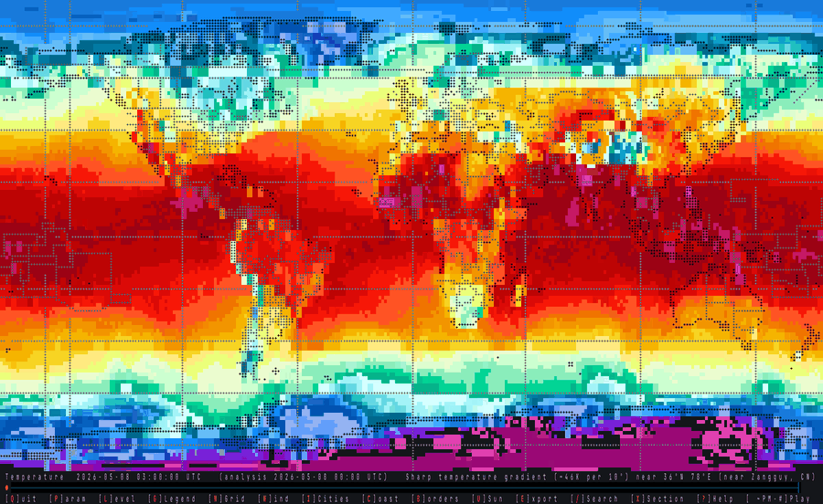 <br/>Global QueryData |

### Radar: ODIM HDF5 and GeoTIFF

- **Polar volumes** (`object=PVOL`) open with one level per sweep, plus a
  synthetic `MAX` level for the column maximum. They support the 3D point
  cloud, the curtain and RHI-style cross-sections.
- **2D composites** (`IMAGE`, `COMP`, `CVOL`) use the same quantity mapping as
  `h5toqd`, with gain and offset applied. Both `nodata` and `undetect` stay
  transparent, because radar dBZ can legitimately be negative.
- **GeoTIFF** is read through GDAL. An FMI-style `GDAL_METADATA` block
  (observation time, quantity, gain, offset, nodata, undetect) or ODIM-style
  metadata overrides guesses from the file name and modification time.

| | |
| --- | --- |
| 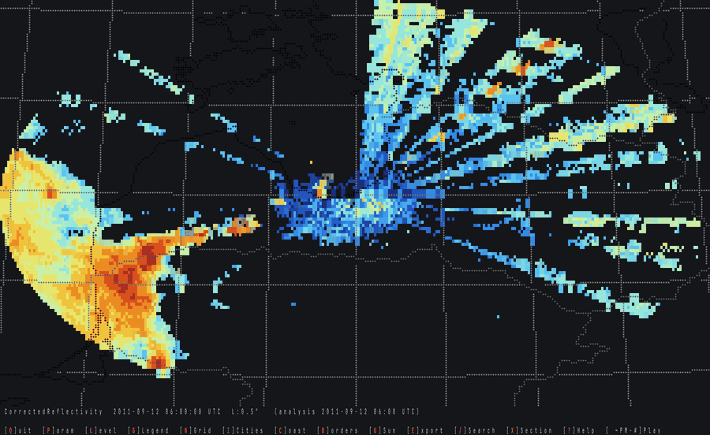 | 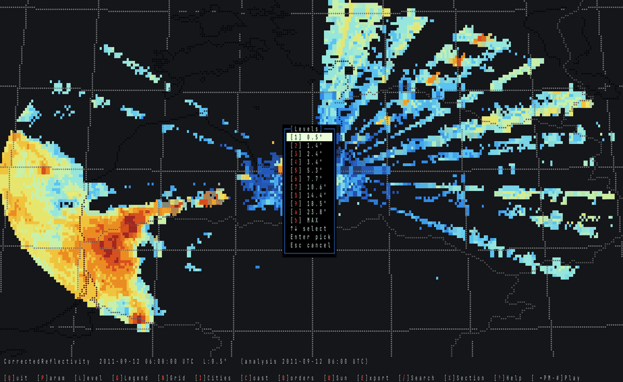 |

### Several files as one animation

```bash
qdless f1.tif f2.tif f3.tif
qdless --dir radar_finland_rr1h_3067
```

The files become the time axis. Each file's time is taken from a 12- or
14-digit `YYYYMMDDhhmm[ss]` timestamp anywhere in its name, or from its
modification time, and all times are UTC. The newest file sets the grid. Files
on a different grid are skipped with a warning.

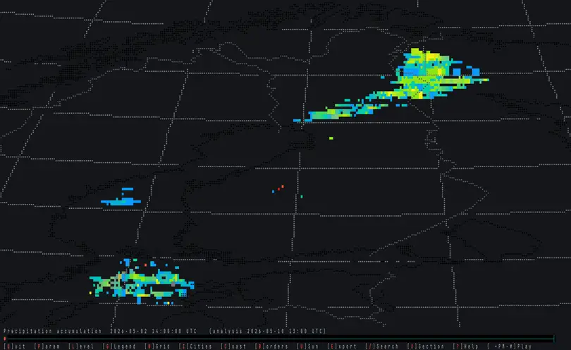

If `--dir` points at a directory with no image files of its own, qdless
treats it as a **tree of PNG products** instead. It lists every
subdirectory that contains PNGs and lets you pick one, and `d` reopens the
list.

### Plain images

PNG, WebP, JPEG, GIF and BMP fill the view directly. Pan and zoom work in
image coordinates, and the geographic overlays are off because there is no
projection. Animated WebP files expose their frames as the time axis. This is
handy for looking at pre-rendered products over a slow link.

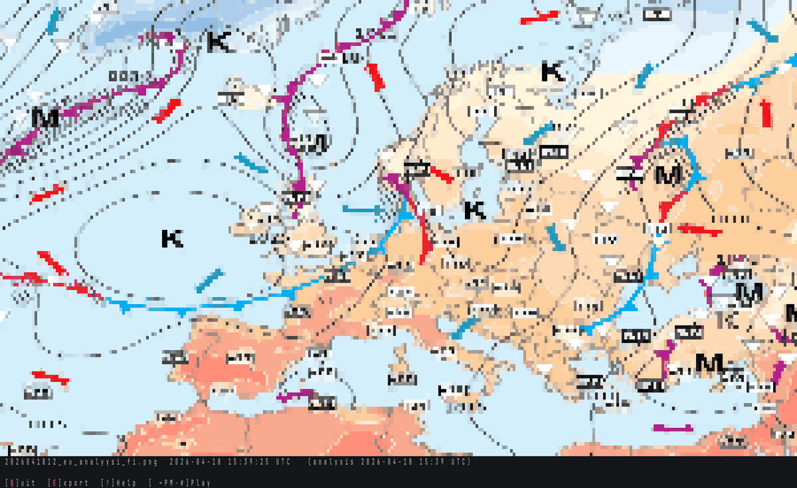

### Shapefiles and PostGIS

Polygons are rasterised into feature IDs and their outlines drawn on top. By
default every distinct name (`NAME`, `NIMI` or the first text field in the
`.dbf`) gets its own colour, and features with the same name share it.

| Key | Action |
| --- | --- |
| click | Show the attributes of the clicked feature |
| `a` | Attribute table: type to filter, `Enter` highlights the feature on the map |
| `o` | Feature outlines: braille → thick → off (separate from `b`) |
| `r` | Colours: one per name ↔ a single flat fill |
| `d` | PostGIS: reopen the table picker |

| | |
| --- | --- |
| 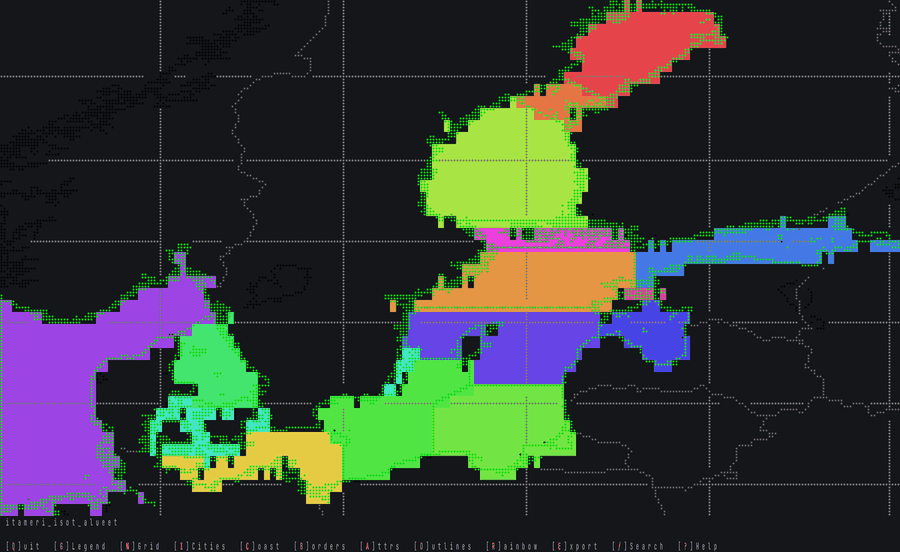 | 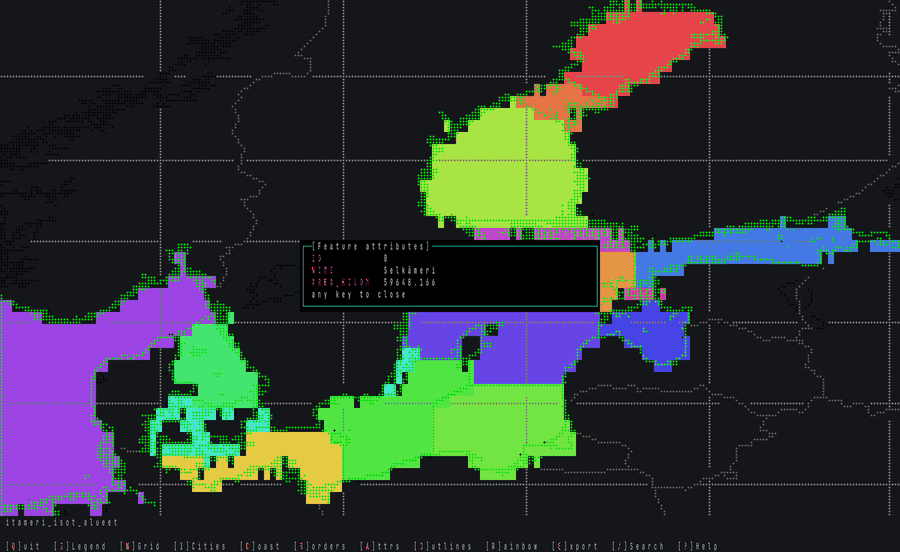 |
| 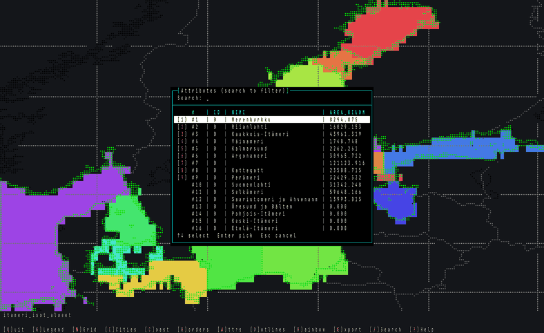 | 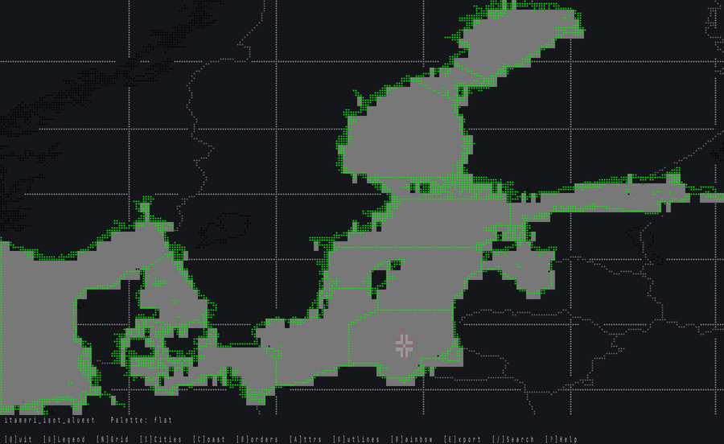 |

PostGIS layers go through the same pipeline:

```bash
qdless --pg "host=db dbname=gis user=me"              # pick a table
qdless --pg "host=db dbname=gis" --schema public      # only tables in one schema
qdless --pg "host=db dbname=gis" --table public.areas # open one table directly
```

The connection stays open, so `d` switches tables without reconnecting. GDAL
must be built with its PostgreSQL driver.

### Masala catalog (SmartMet/radon file store)

```bash
qdless --catalog /masala/datasets                            # browse
qdless --catalog /masala/datasets/131/202606130000/ECEUR0100 # open a cube
qdless --catalog                                             # find weather mounts in fstab
```

In a radon-style store, `<root>/<producer>/<reftime>/<geometry>/<leadtime>/`
holds one file per parameter, level and lead time. qdless browses it as
columns: producer → reference time → geometry. `↑`/`↓` move, `→` or `Enter`
opens, `←` goes back up (landing on the entry you came from), and `Esc`
cancels. Entries are labelled with model names where known (e.g.
`131/   ECG`). When you open a geometry directory, its files become one source
with parameters, levels and lead times, read one slice at a time on demand.

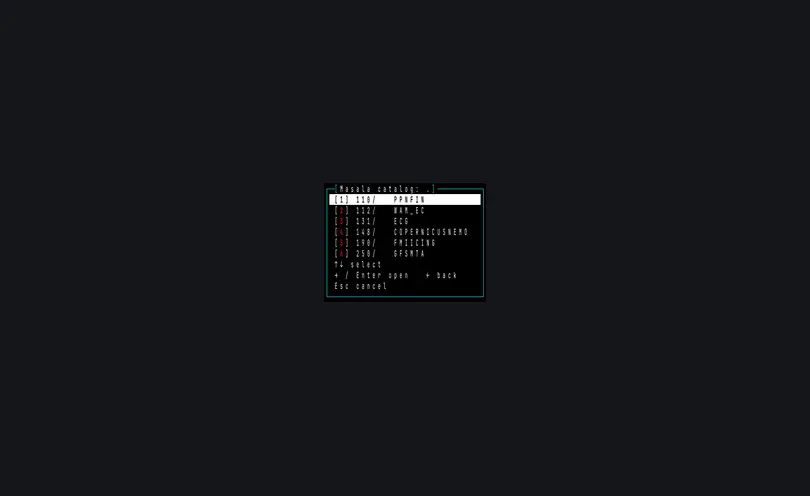

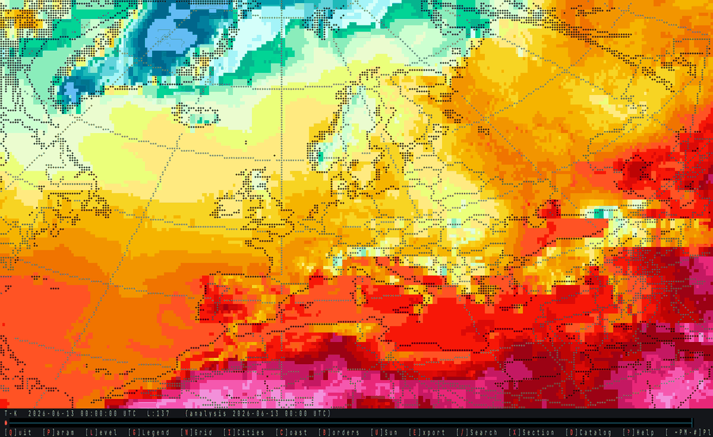

With the catalog open, `d` returns to the picker. For a plain file, `d` lists
the weather-data mounts found in `/etc/fstab` (`$QDLESS_FSTAB` overrides the
path). Pressure and height cubes support the 3D views. Radar GeoTIFF nowcast
directories open as animations of the latest run. Files on `s3fs` mounts are
read from the local s3fs cache when a cached copy exists.

## 20. Exit effects

Quitting plays a short full-screen animation drawn from the current view.
There are over 300 effects in eleven themes, from cinema to weather.

| Tornado | Aurora | Hurricane eye |
| --- | --- | --- |
| 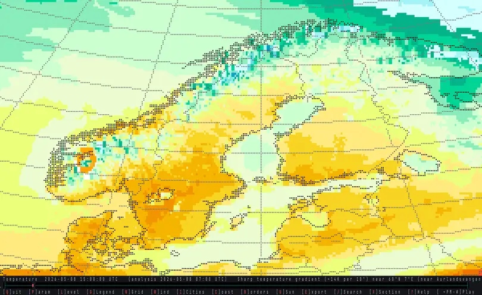 |  |  |

```bash
qdless --list-exit-effects                  # names, grouped by theme
qdless --exit-effect Tornado f.sqd          # always play this one
qdless --exit-effect "Tornado,Aurora" f.sqd # pick randomly from a set
qdless --exit-message "SEE YOU" f.sqd       # text for the word-reveal effect
qdless --no-exit-effect f.sqd               # quit immediately
```

To preview effects without quitting: `F8` opens a theme → effect picker, `F9`
plays the next effect, `F10` replays the last one, `F11` plays it again with a
new random seed (or the next line for word reveal), and `F12` picks a
word-reveal line.

## 21. Headless use: `--dump` and `--extrema`

`--dump` renders a single frame to stdout and exits, which is useful in
scripts and CI and over pipes. The first line is a summary header:

```
[qdless] fmi.sqd | param: Pressure | time: 2026-05-08 07:00:00 UTC (1/118) | analysis: 2026-05-08 07:00 UTC | level: 0 (1/1) | range: [1006.14, 1027.2] | palette: pressure | coast: 6200+1758 polylines | hint: Cyclone low …
```

The options that choose what is shown work with it: `-p`, `-t`, `-l`,
`--palette`, `--3d`, `--globe` and `--sun`.

`--extrema` prints the strongest persistent 3D maxima and minima of the active
parameter (after removing each level's median) as text, then exits.

## 22. Configuration and files

| What | Default location | Override |
| --- | --- | --- |
| Palettes (`*.json`, converted from FMI `wms-conf`) | `/usr/share/smartmet/qdless/palettes` | `--palette-dir`, `~/.config/qdless/palettes/` |
| Parameter → palette map | `/usr/share/smartmet/qdless/qdless.conf` | `-c` / `--config` |
| GeoNames places | `/usr/share/smartmet/qdless/cities1000.tsv` | `~/.config/qdless/cities1000.tsv` |
| Coastlines, borders, rivers (GSHHG) | `/usr/share/gshhg-gmt-nc4` | `--coastline-dir` |
| grid-files configuration | `/usr/share/smartmet/library/grid-files/grid-files.conf` | `$QDLESS_GRID_FILES_CONF` |
| fstab used for mount discovery | `/etc/fstab` | `$QDLESS_FSTAB` |

`qdless.conf` is JSON and maps parameter names (case-insensitive) to palette
names. If a parameter isn't listed, qdless guesses a palette from its unit
and name, and falls back to a built-in ramp. `--palette NAME` overrides both.
To regenerate the palettes from `wms-conf`, run
`scripts/wmsconf2palette.py`. Packagers can compile in a different data
directory with `-DQDLESS_DATA_DIR=...`.

For mouse debugging, `QDLESS_DEBUG_MOUSE=1` logs every mouse event to
`/tmp/qdless-mouse.log`.

## 23. Key reference

### 2D map

| Key | Action |
| --- | --- |
| `q`, `Esc` | Quit |
| `p` | Parameter menu |
| `L` | Level menu |
| `<` `>`, `,` `.` | Level down / up |
| `←` `→`, `Home` `End` | Time step, first / last time |
| `Space`, `↑` `↓` | Play / pause, speed |
| `+` `-`, `0` | Zoom, reset |
| `h` `j` `k` `l`, `Shift`+arrows, drag | Pan |
| double-click L / R | Zoom in / out at the pointer |
| click | Probe (gridded data), feature attributes (vector data), activate panel |
| `g` | Legend |
| `M` | File metadata |
| `c`, `b`, `n` | Coastlines, borders, graticule: braille → thick → off |
| `i`, `PgUp` `PgDn` | Cities, fewer / more cities |
| `w` | Wind arrows |
| `t` | Cell style: sextants → triangles → squares |
| `s` | Graphics: blocks → Kitty → Sixel |
| `u` | Twilight shadow |
| `/` | Place search |
| `x` | Cross-section (`y` Y axis, `H` Hovmöller) |
| `v` | 3D curtain |
| `3` | 3D point cloud |
| `G` | Globe |
| `e` | Export PNG |
| `d` | Catalog / table / mount picker |
| `F2`, `Tab`, `1`–`4` | Layout, active panel |
| `a`, `o`, `r` | Vector data: attribute table, outlines, colours |
| `?` | Help |

The curtain, point cloud and globe keys are listed in their own sections:
[12](#12-3d-curtain-the-animated-cross-section),
[13](#13-3d-point-cloud) and [14](#14-globe-view).
`p`, `L`, `e`, `M`, `u` and `?` work in every view.

## 24. Command-line reference

```
qdless [options] <file> [<file> ...]
qdless [options] --dir <directory>
qdless [options] --catalog [<path>]
qdless [options] --pg "<dsn>" [--schema <name>] [--table schema.name]
```

| Option | Description |
| --- | --- |
| `-p`, `--param` | Parameter name; comma-separated for several panels |
| `--layout` | `single`, `side` or `quad` (default: from `-p`) |
| `-t`, `--time` | Start time index (0-based; `-1` = last) |
| `-l`, `--level` | Start level index (0-based; `-1` = last) |
| `--palette` | Palette name, overriding the configuration |
| `--palette-dir` | Directory of palette JSON files |
| `-c`, `--config` | Path to `qdless.conf` |
| `--coastline-dir` | Directory of GSHHG binned NetCDF files |
| `--no-coastline`, `--no-borders` | Start with coastlines / borders off |
| `--min-lake-area` | Smallest lake to draw, km² (default 3000) |
| `--min-lake-roundness` | Minimum lake compactness 4πA/L² (default 0.15) |
| `--min-island-area` | Smallest island to draw, km² (default 10; 0 = all) |
| `--3d` | Start in the 3D point cloud |
| `--globe`, `--globe-surface` | Start on the globe; initial surface fill |
| `--sun` | Start with the twilight shadow on |
| `--dump` | Render one frame to stdout and exit |
| `--extrema` | Print persistent 3D extrema and exit |
| `--dir` | Directory of files forming a time series, or a PNG tree to browse |
| `--catalog` | Masala / radon store root or cube; no path = discover mounts |
| `--pg`, `--schema`, `--table` | PostGIS connection, schema filter, table |
| `--file` | Input file(s), the same as positional arguments |
| `--exit-effect`, `--exit-message`, `--no-exit-effect`, `--list-exit-effects` | Exit effect control |
| `-h`, `--help` | Show the option list |
